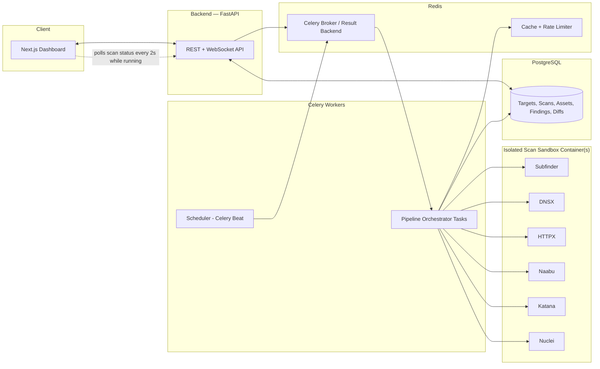

# Module 1 — Attack Surface Management (ASM)
## Architecture Design Document

Stack: FastAPI + Celery (backend), Next.js (frontend), PostgreSQL + Redis (data layer), Docker Compose with an isolated scan sandbox (deployment).

---

## 1. Scope & Positioning

Module 1 discovers and tracks a target's external attack surface over time: subdomains, resolved DNS, live hosts, open ports, HTTP fingerprints, TLS certs, crawled endpoints, and vulnerability findings.

**Engineering value is in orchestration, not scanning.** Subfinder, DNSX, HTTPX, Naabu, Katana, and Nuclei do the actual probing. This system schedules them, chains their output into a pipeline, persists results, diffs snapshots over time, and surfaces everything in a dashboard. The README and in-app footer must state this explicitly, per tool, with version and license.

**Safety constraint (hard-coded, not a setting):** the default and seed target is a self-owned lab — self-hosted VPS, DVWA, Juice Shop. Adding any new target requires an explicit authorization confirmation step (Section 6.5) before the first scan is allowed to run against it.

---

## 2. High-Level Architecture



Key flow: user adds/confirms a target → schedule created (or scan run manually) → Celery Beat/API enqueues a pipeline job → orchestrator task runs tool stages in the sandbox container(s) in sequence → raw output parsed and normalized → written to Postgres → diff engine compares against the previous snapshot for that target → diff events stored, and the frontend picks them up via polling (Section 4.1 — chosen over WebSockets for this module).

---

## 3. Backend Architecture (FastAPI + Celery)

### 3.1 Service boundaries

- **API service** (FastAPI, Uvicorn/Gunicorn): CRUD for targets/schedules, scan trigger endpoints, read endpoints for assets/findings/diffs and live scan progress (polled, Section 4.1), auth.
- **Celery worker(s)**: execute the recon pipeline. Separate worker queue/concurrency pool for scan tasks vs. lightweight tasks (e.g., `queue=scans` vs `queue=default`) so a long Nuclei run doesn't starve quick jobs.
- **Celery Beat**: cron-style scheduler that enqueues scan jobs per target's configured cadence (e.g., daily subdomain sweep, weekly full pipeline).
- **Scan sandbox**: the actual tool binaries run in a separate container (or containers) that the worker calls into — via a thin internal HTTP/gRPC "runner" service, or via Docker SDK `exec` into a locked-down sibling container. This isolates arbitrary tool crashes/resource use from the API/worker process and gives a clean place to enforce network egress restrictions (allowlist target IP/domain ranges only).

### 3.2 Pipeline orchestration model

Each scan run is a **Celery chain/chord** of stages, not one monolithic task, so partial failures are isolated and each stage's output is checkpointed:

1. `resolve_scope` — validate target is authorized, load target config.
2. `subfinder_stage` — passive subdomain enumeration → list of hostnames.
3. `dnsx_stage` — resolve hostnames → A/AAAA/CNAME records, filter dead entries.
4. `httpx_stage` — probe live hosts → status code, title, tech stack, TLS cert info.
5. `naabu_stage` — port scan on resolved IPs → open ports.
6. `katana_stage` — crawl live HTTP services → endpoint list (bounded depth/rate for lab safety).
7. `nuclei_stage` — run templates against crawled/live targets → findings.
8. `normalize_and_persist` — parse each tool's JSON output into the DB schema (Section 5).
9. `diff_stage` — compare this run's asset/finding set to the previous completed run for the same target; write `diff_events`.
10. `notify` — mark scan `completed`, store per-stage timing and exit codes for observability (picked up by the frontend on its next poll, Section 4.1).

Each stage's task signature carries `scan_run_id` so results always tie back to one run row; stage status is written incrementally so the dashboard can show live progress ("Naabu running... 3/6 stages").

### 3.3 Tool invocation layer

A thin `ToolRunner` abstraction per tool: builds the CLI args, executes with a timeout, captures stdout as JSON (all six tools support `-json`/`-jsonl` output), and returns a typed parsed result. This is the seam that keeps "our code" (parsing, retries, error classification) separate from "their code" (the actual binary) — worth calling out explicitly in code comments/README since it's the crux of the "orchestration not scanning" positioning.

### 3.4 Diffing engine

Diffing runs on normalized DB rows, not raw tool output, so it's tool-agnostic:

- **New subdomain**: hostname present in run N, absent in run N-1.
- **Removed subdomain**: inverse.
- **New open port**: (ip, port) pair new for a host.
- **Closed port**: inverse.
- **Cert change**: fingerprint/serial/expiry differs for the same host on the same port.
- **New/changed HTTP fingerprint**: status code, title, or detected tech stack changed.
- **New finding**: Nuclei template ID + matched-at combination not seen in prior run.

Each detected change becomes a row in `diff_events` with `severity`, `change_type`, `before`/`after` JSONB, and `first_seen`/`scan_run_id`. This is what makes the dashboard timeline feature possible without re-diffing on every read.

### 3.5 API surface (representative, not exhaustive)

- `POST /targets` — add target (triggers authorization-confirmation flow before it's scannable)
- `GET /targets` / `GET /targets/{id}`
- `POST /scan-profiles` / `GET /scan-profiles` / `PUT /scan-profiles/{id}` — named tool configs (Section 3.6)
- `POST /targets/{id}/scans` — trigger scan using a profile (defaults to the standard profile if omitted)
- `POST /targets/{id}/scans/{tool}` — trigger a single tool ad hoc (e.g., just re-run Nuclei) using that tool's saved options
- `GET /scans/{id}` — scan run status + stage timings
- `GET /scans/{id}/stages/{tool}` — stage detail: exact command executed, exit code, duration, result count
- `GET /targets/{id}/assets` — current subdomains/ports/http services (latest snapshot)
- `GET /targets/{id}/diffs?since=` — timeline of diff events
- `GET /targets/{id}/findings` — Nuclei findings, filterable by severity
- `POST /schedules` / `GET /schedules` — cadence config per target (references a scan profile)

### 3.6 Scan profiles — Default mode vs. Advanced mode

Every tool tab has exactly two modes, not a spectrum of settings to learn:

- **Default**: one hardcoded, lab-safe invocation per tool. No form to fill in — click "Run" and it runs the baseline command. This is what a fresh install uses out of the box.
- **Advanced**: the same tab exposes a curated set of extra flags as dropdowns/toggles/sliders, drawn from an **allowlist**, not the tool's full `--help` output.

On why not "just expose everything from `--help`": most CLI flags on these tools fall into three buckets that shouldn't be user-editable at all — (1) noise that doesn't change results (`-silent`, `-no-color`, `-version`), (2) flags that write to or read from arbitrary filesystem paths (`-o`, `-resume`, `-config`, `-provider-config`) which the backend already controls internally, and (3) flags that can route traffic outside the sandbox or outside scope (`-proxy`, custom `-resolver` values, `-interactsh-server`). Exposing the full flag list would mean building input validation against dozens of edge cases, most of which add no value for an ASM dashboard and some of which are genuine footguns (see Nuclei below). The allowlist below is the practical middle ground: enough control to matter, nothing that can misfire.

```
scan_profiles
  id, name, is_default (bool),
  tool_config (JSONB):
    subfinder: { mode: default|advanced, all: bool, sources: [...], max_time: int, recursive: bool }
    dnsx:      { mode: default|advanced, record_types: [a,aaaa,cname,ns,mx,txt], resolver: "1.1.1.1"|"8.8.8.8", rate_limit: int }
    httpx:     { mode: default|advanced, tech_detect: bool, screenshot: bool, favicon: bool, max_redirects: int, threads: int }
    naabu:     { mode: default|advanced, ports: "top-100"|"top-1000"|"full"|custom_list, rate: int }
    katana:    { mode: default|advanced, depth: int, js_crawl: bool, known_files: none|robots|sitemap|all, rate: int }
    nuclei:    { mode: default|advanced, severity: [...], tags: [...], intrusive_confirmed: bool, rate_limit: int, concurrency: int }
    enabled_stages: [subfinder, dnsx, httpx, naabu, katana, nuclei]
```

Per-tool allowlist (Advanced mode only — Default ignores all of this and uses the baseline command):

| Tool | Default command runs | Advanced allowlist | Deliberately excluded |
|---|---|---|---|
| Subfinder | Passive enum, free sources only, `-json` | `-all` (include slower sources), `-sources` (pick from free sources: crt.sh, HackerTarget, AlienVault, Anubis, URLScan — API-key sources like Shodan/Censys deferred to a future "API keys" settings screen), `-max-time`, `-recursive` | `-proxy`, `-provider-config`, custom `-o` |
| DNSX | Resolve `-a -aaaa -cname` via a trusted public resolver | Record-type toggles (`ns`, `mx`, `txt`), resolver picked from a **fixed dropdown** (1.1.1.1 / 8.8.8.8), `-rate-limit` | Free-text custom resolver (DNS rebinding/exfil risk), `-proxy` |
| HTTPX | `-sc -title -tech-detect -tls-grab`, follow up to 3 redirects | `-screenshot` (off by default, heavier), `-favicon`, `-server`, redirect cap, `-threads`/`-rate-limit` | `-proxy`, custom method/raw request flags |
| Naabu | `-top-ports 100`, connect scan (no raw sockets needed), conservative rate | Port range (`top-1000` / full `1-65535` / validated custom list), rate slider capped at a safe max so you can't accidentally flood your own lab | SYN scan mode (needs `CAP_NET_RAW` in the sandbox — extra attack surface for one flag's benefit; connect scan is enough for ASM purposes), `-proxy` |
| Katana | `-depth 2`, no JS crawl, `robots`+`sitemap` known-files | Depth slider (1–5), `-jc` JS crawl toggle (flagged as slower), known-files mode, concurrency/rate sliders | `-proxy`, `-headless` (spins a real browser — resource-heavy; revisit later if needed), arbitrary custom headers beyond User-Agent |
| Nuclei | Severity `medium,high,critical`, **tags `dos`, `fuzz`, `intrusive` excluded**, default template set, conservative rate | Include `low`/`info` severities, custom template/tag selection from the installed template set (never an arbitrary path/URL), rate/concurrency sliders | `-proxy`, `-interactsh-server`, `-update-templates` (done as a separate maintenance job, never mid-scan) |

**Nuclei's `dos`/`fuzz`/`intrusive` tags are the one flag category that stays behind a second gate even in Advanced mode**: enabling them requires ticking `intrusive_confirmed` with inline copy explaining that these templates can disrupt a live service — including your own lab. Everything else in the allowlist is safe to flip freely.

The `ToolRunner` (Section 3.3) builds the CLI command from `tool_config` for the enabled stages only — a stage not in `enabled_stages` is skipped entirely for that run. Flags are always rendered through structured form controls, never a raw free-text argument field, so the UI itself can't be used to inject arbitrary CLI arguments into the sandbox.

Every executed stage is recorded in `stage_executions` (Section 5) with the **literal command string** that ran, so the dashboard can show, next to each tool's results, exactly what was executed, in both Default and Advanced mode — this is the main proof point for the "we orchestrate, we don't just wrap a script" positioning.

### 3.7 Nuclei/Katana targeting — all crawled endpoints vs. a selected subset

Two modes, chosen at the moment a scan is triggered (not saved on the profile, since which URLs exist changes every crawl):

- **Default**: Nuclei runs against every endpoint Katana crawled for that target in the current run (post-dedup, Section 5) plus the live hosts HTTPX found. This is the "just run everything" path for scheduled/automatic scans.
- **Advanced**: after reviewing Katana's results tab, the user checks specific rows and clicks "Run Nuclei on selected" — only those URLs are passed as Nuclei's target list. Useful for re-testing one endpoint after a fix, or focusing a slow/intrusive template set on a handful of interesting paths instead of the whole crawl.

Mechanically: `POST /targets/{id}/scans/nuclei` accepts `{ target_source: "all_crawled" | "selected", endpoint_ids: [...] }` (the second field only used/required when `target_source = "selected"`). Scheduled pipeline runs always use `all_crawled`, since there's no user present to make a selection ahead of time.

### 3.8 Project lifecycle & retention

Every target is created as one of two project types, chosen in the "Add target" modal:

- **Temporary** — for quick one-off tests. Carries a rolling `expires_at`, reset to `now() + 7 days` on every scan run or dashboard visit to that target. If it sits untouched for 7 days, it's deleted permanently — target row, all assets, all scan history, cascade.
- **Permanent** — for anything you actually want to keep tracking (your lab VPS, DVWA, Juice Shop). Never auto-deleted.

A daily Celery Beat job (`cleanup_expired_targets`) queries `targets WHERE project_type = 'temporary' AND expires_at < now()` and deletes them (with a log entry, so a demo audience can see the policy actually firing rather than just existing as a claim). This is separate from — and doesn't replace — a second retention concern that still needs a decision either way: even for **Permanent** targets, raw tool output (`stage_executions.raw_output_path`, large `findings.raw_output` JSONB) will accumulate indefinitely. Recommendation: keep all normalized rows forever (they're small and are what the diff timeline depends on), but prune raw JSONB/output files older than the last N runs (e.g., N=20) via the same daily job. Open question is just the value of N — fine to default to 20 and adjust later.

---

## 4. Frontend Architecture (Next.js)

### 4.1 Structure

- **App Router** (`app/`) with route groups: `/targets`, `/targets/[id]` (overview, assets, findings, timeline tabs), `/scans/[id]` (live run view), `/settings`.
- **Data fetching**: Server Components for initial page load (direct fetch from FastAPI at request time, or via a typed API client), client-side React Query (TanStack Query) for everything that changes after load. Live scan progress uses **polling, not WebSockets** — `useScanProgress` refetches `GET /scans/{id}` every ~2s while `status = running`, backs off automatically once the status is `completed`/`failed`. Reasoning: scan stages take seconds to minutes, so sub-second push latency buys nothing a user would notice; polling needs no persistent-connection infra, no Redis pub/sub fan-out if the API ever scales to multiple replicas, and works trivially with the existing cookie-session auth. WebSockets are a reasonable upgrade later if a stage-by-stage live log stream is wanted, but add real infra cost for no visible benefit at this stage.
- **State**: mostly server-driven; light client state (filters, selected severity, date range) via URL search params so views are shareable/bookmarkable.
- **UI**: Tailwind + shadcn/ui. Key components: `AssetTable` (subdomains/ports/http), `DiffTimeline` (chronological feed of diff_events, Censys-style), `ScanProgress` (stage checklist with live status), `FindingsList` (severity-colored, grouped by template), `ToolConfigForm` (per-tool option controls), `CommandViewer` (read-only display of the executed command string + exit code).
- **Auth**: single-user, no roles/accounts. One admin password from an env var (`ADMIN_PASSWORD`), issued as a signed session cookie on login; middleware gates all routes except `/login`. No `users` table needed.

### 4.2 Key screens for Module 1

1. **Target list** — cards/table of targets, last scan time, asset counts, open findings count, "new activity" badge if unread diffs exist.
2. **Target overview** — current asset inventory snapshot + summary stats.
3. **Diff timeline** — the differentiating feature: chronological list of "new subdomain appeared," "port 8080 opened on X," "cert rotated on Y," filterable by change type/severity.
4. **Live scan view** — stage-by-stage progress for an in-flight run.
5. **Per-tool tabs** (Subfinder / DNSX / HTTPX / Naabu / Katana / Nuclei) — each tab has:
   - A **Default/Advanced switch**. Default hides the config panel entirely (just a "Run" button). Advanced reveals the allowlisted flag controls from Section 3.6.
   - **Config panel** (Advanced only): form controls for that tool's allowlisted flags, plus a "Run this tool only" button for ad hoc single-stage runs.
   - **Results panel**: that tool's latest output for the target (deduplicated for Katana/HTTPX, Section 5), with a `CommandViewer` showing the exact command last executed, its exit code, duration, and result count — so what ran is never a black box.
   - On the **Katana tab specifically**: row checkboxes + a "Run Nuclei on selected" button implementing the Section 3.7 targeting choice; if nothing is selected, running Nuclei from its own tab defaults to all crawled endpoints.
6. **Findings view** — Nuclei results, severity-sorted, linkable back to the asset that produced them.
7. **Scan profiles screen** — create/edit named tool-option bundles (Section 3.6), mark one default, assign a profile to a schedule.
8. **Add target / authorization confirmation modal** — the mandatory gate described in 6.5, plus a required **Temporary vs. Permanent** project-type choice (Section 3.8); Temporary targets show a countdown to their next auto-delete based on `expires_at`.

---

## 5. Database Design (PostgreSQL)

```
targets
  id, name, root_domain, is_authorized (bool), authorized_at, authorization_note,
  scope_config (JSONB: cidrs, excluded_subdomains, rate_limits),
  project_type (temporary|permanent), expires_at (nullable — set only for temporary), created_at

scan_profiles
  id, name, is_default (bool), tool_config (JSONB — per-tool flags + enabled_stages, see Section 3.6)

schedules
  id, target_id (FK), scan_profile_id (FK), cadence_cron, enabled, next_run_at

scan_runs
  id, target_id (FK), scan_profile_id (FK), triggered_by (manual|scheduled), tool (nullable —
  set when this run is a single ad hoc tool run rather than a full pipeline),
  status (queued|running|completed|failed), started_at, completed_at,
  stage_status (JSONB: {stage: status/duration}), error

stage_executions
  id, scan_run_id (FK), tool, command (text — literal CLI string executed), started_at,
  completed_at, exit_code, result_count, raw_output_path

subdomains
  id, target_id (FK), scan_run_id (FK, last-seen run), hostname, source_tool,
  first_seen_run_id, last_seen_run_id, is_active (bool)

dns_records
  id, subdomain_id (FK), record_type, value, scan_run_id, recorded_at

http_services
  id, subdomain_id (FK), url, normalized_url, status_code, title, tech_stack (JSONB),
  server_header, first_seen_run_id, last_seen_run_id, occurrence_count

ports
  id, target_id (FK), ip, port, protocol, service_guess, first_seen_run_id, last_seen_run_id

tls_certs
  id, http_service_id (FK), fingerprint_sha256, subject, issuer, not_before, not_after,
  scan_run_id (FK)

crawled_endpoints
  id, http_service_id (FK), url, normalized_url, method, status_code,
  first_seen_run_id, last_seen_run_id, occurrence_count
  UNIQUE (http_service_id, normalized_url, method)

findings
  id, target_id (FK), scan_run_id (FK), template_id, severity, matched_at,
  description, raw_output (JSONB), first_seen_run_id

diff_events
  id, target_id (FK), scan_run_id (FK), change_type (new_subdomain|removed_subdomain|
  new_port|closed_port|cert_change|http_change|new_finding), entity_ref (JSONB),
  before (JSONB), after (JSONB), severity, created_at
```

Notes:
- Every "current state" table (`subdomains`, `ports`, `http_services`, `crawled_endpoints`) keeps `first_seen_run_id`/`last_seen_run_id` rather than duplicating a full row per run — full history for time-series/audit lives in per-run child tables where needed (`dns_records`, `tls_certs`) or is reconstructable from `diff_events`.
- `scope_config` JSONB on `targets` is what the sandbox's egress allowlist is built from — the orchestrator reads this before every scan, not just at target-creation time.
- No `users`/roles tables — single-user by design (Section 4.1 auth).

### Deduplication rule (Katana / HTTPX)

Katana in particular re-emits the same effective URL many times (hit via different links, forms, redirects, or JS-discovered references), and HTTPX can do the same across redirect chains. `normalize_and_persist` computes `normalized_url` for every crawled endpoint and HTTP service before writing it: lowercase host, strip URL fragment, drop default ports, sort query-string keys, trim trailing slash. The `UNIQUE (http_service_id, normalized_url, method)` constraint on `crawled_endpoints` turns repeat hits into an `UPDATE occurrence_count = occurrence_count + 1, last_seen_run_id = ...` instead of a new row, so the dashboard shows one row per real endpoint. Query-parameter *values* are intentionally not collapsed (e.g. `?id=1` vs `?id=2` stay distinct) since that path-templating is a stretch goal, not MVP — collapsing it too aggressively risks hiding genuinely different endpoints.

### Redis usage

- Celery broker + result backend (separate logical DB index from cache).
- Cache: latest-asset-snapshot reads, rate-limit counters for outbound tool requests (protects the lab target from being hammered by an over-eager Naabu/Katana config).

---

## 6. Deployment Architecture

Recommendation: **Docker Compose on a single self-hosted VPS, with recon tools isolated in a dedicated sandbox container/network** — matches the "own lab" requirement directly and keeps Module 1 shippable without Kubernetes overhead; can be revisited for later modules if the portfolio needs that signal.

### 6.1 Compose services

- `frontend` — Next.js (standalone build), reverse-proxied.
- `api` — FastAPI/Uvicorn.
- `worker` — Celery worker(s), scaled via `--concurrency` and/or multiple replicas for the `scans` queue.
- `beat` — Celery Beat scheduler (single instance).
- `postgres` — persistent volume.
- `redis` — broker/cache.
- `scan-sandbox` — image with Subfinder/DNSX/HTTPX/Naabu/Katana/Nuclei installed; **no ports exposed externally**, attached to a restricted Docker network with egress limited to the lab target's IP range (iptables/Docker network policy), invoked by the worker via Docker socket-scoped `exec` or a small internal runner API.
- `nginx` (or Caddy) — TLS termination + reverse proxy to `frontend`/`api`.

### 6.2 Why an isolated sandbox

- Tool crashes/OOM (Naabu/Katana can be resource-heavy) don't take down the worker process.
- Egress restriction lives at the network layer, not just app logic — a bug in scope validation can't accidentally scan the internet.
- Clean audit boundary: every outbound recon packet originates from one container whose network policy is reviewable and demoable in the README ("here's how we make sure this only ever hits the lab").

### 6.3 Observability (minimal for Module 1)

- Structured logs (JSON) from API/worker to stdout, collected via Docker logging driver.
- `scan_runs.stage_status` + `error` columns double as the primary debugging surface for demo purposes; a full metrics stack (Prometheus/Grafana) is a stretch goal, not required for MVP.

### 6.4 Secrets/config

`.env` per service, Postgres/Redis credentials injected via Compose secrets, no tool API keys needed for the six OSS tools used here.

### 6.5 Authorization gate (mandatory, not optional)

Enforced at two layers so it can't be bypassed by a direct API call:
1. **API layer**: `POST /targets` requires `is_authorized=true` to be set explicitly via a confirmation endpoint (`POST /targets/{id}/confirm-authorization`) with a required free-text attestation stored in `authorization_note`. Scans cannot be enqueued for a target where `is_authorized IS NOT TRUE`.
2. **Sandbox network layer**: the sandbox's egress allowlist is derived only from `scope_config` on authorized targets; unauthorized/unconfirmed targets never reach the sandbox's network policy at all.

Seed data ships with the lab target pre-authorized (self-hosted VPS/DVWA/Juice Shop) so the default demo requires zero extra clicks.

---

## 7. Tech Stack Summary

| Layer | Choice |
|---|---|
| Backend API | FastAPI (Python) |
| Task queue / scheduler | Celery + Celery Beat |
| Frontend | Next.js (React, TypeScript, Tailwind + shadcn/ui) |
| Database | PostgreSQL |
| Cache / broker | Redis |
| Recon engines (third-party) | Subfinder, DNSX, HTTPX, Naabu, Katana, Nuclei |
| Deployment | Docker Compose, isolated scan sandbox container/network |
| Reverse proxy / TLS | Nginx or Caddy |

---

## 8. Open Decisions for Next Session

All items from the previous round are now resolved:

- Single-user, no roles/`users` table (Section 4.1).
- Katana/HTTPX duplicate results deduplicated via `normalized_url` + unique constraint (Section 5, "Deduplication rule").
- Per-tool tabs, each with a Default (hardcoded, no config) mode and an Advanced mode exposing a curated flag allowlist — not the full `--help` list — with reasoning and a per-tool table (Section 3.6). Nuclei's disruptive tags sit behind an extra confirmation.
- Nuclei/Katana targeting: all crawled endpoints by default, or a user-selected subset via checkboxes on the Katana tab (Section 3.7).
- Project lifecycle: Temporary (7-day inactivity auto-delete) vs. Permanent (never auto-deleted) chosen per target at creation; a daily cleanup job enforces it (Section 3.8).
- Live scan progress uses polling (~2s interval while running), not WebSockets — simpler infra, no perceptible latency cost at this scan-duration scale (Section 4.1).

One item still open, low-stakes enough to decide during implementation rather than now: the exact **N** for how many recent runs' raw JSONB/output files to keep per target before pruning (Section 3.8 defaults to 20).

Architecture is settled for Module 1 — ready to move to implementation planning/coding whenever you are.
